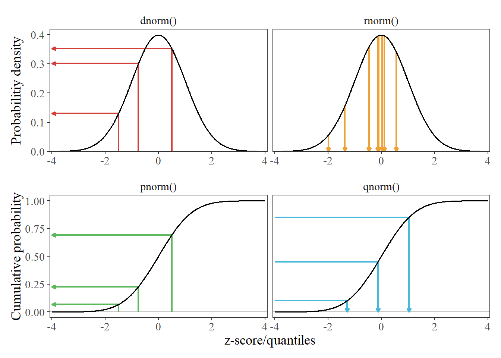
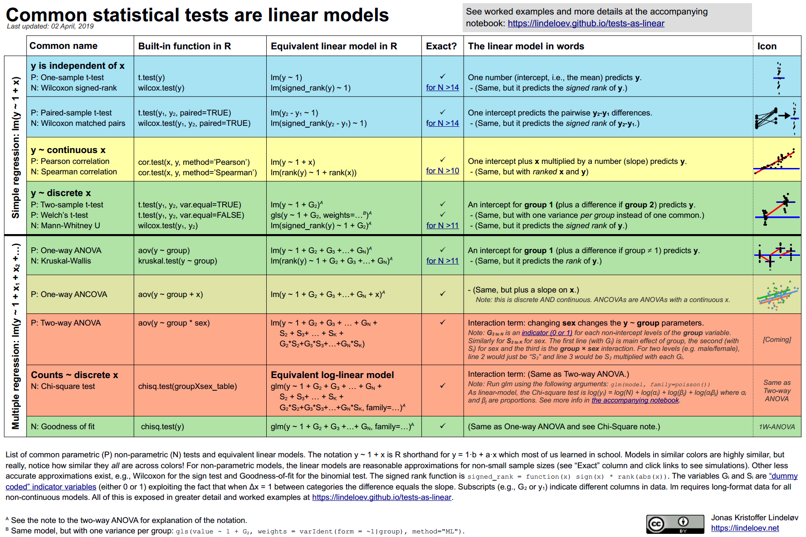

::: {.callout-caution title="Under construction"}
:::

In every quantitative endeavour, one question matters most: **what is the estimand?**
The estimand is the precise quantity we use data to draw inference about.
Too often the estimand is not defined before leaping straight to describing data and methods.
This renders it *impossible* to assess the appropriateness of those data and methods.

## Mathematics

### Updated mental models

Numbers aren’t just a count; a better viewpoint is a *position on a line*.
This position can be negative ($-1$), between other numbers ($\sqrt{2}$), or in another dimension ($i$).

Arithmetic became a general way to transform a number.
Addition is sliding along the number line ($+ 3$ means slide 3 to the right) and multiplication is scaling ( $\times 3$ means scale it up 3 times).

Mathematically, the exponent function does this:

$$
\mathrm{original} \times \mathrm{growth}^{\mathrm{duration}} = \mathrm{new}
$$

or

$$
\mathrm{growth}^{\mathrm{duration}} = \frac{\mathrm{new}}{\mathrm{original}}
$$

| Operation | Old concept | New concept |
| :--- | :--- | :--- |
| Addition | Repeated counting | Sliding |
| Multiplication | Repeated addition | Scaling |
| Exponents | Repeated multiplication | Growth for amount of time |

#### Understanding $e$ (it's about *growth*)

The number $e$ is the base amount of growth shared by *all* continually growing processes.
The number $e$ merges Rate and Time.
When we write:

$$
e^x
$$

The variable $x$ is actually a combination of *rate* and *time*.

$$
x = \text{rate} \times \text{time}
$$

So, our general formula becomes:

$$
\text{growth} = e^x = e^{r t}
$$

The number $e$ is about continuous growth.
Intuitively, $e^x$ means:

* How much growth do I get after after $x$ units of time (and 100% continuous growth)

100% continuous growth means that, at any given time, the rate of change is always equal to our current value.
Or more mathy: (d/dx)*(e^x) = e^x

#### Understanding $ln()$ (it's about *time*)

* $e^x$ lets us plug in **time** and get growth.
* $ln(x)$ lets us plug in **growth** and get the **time it would take**.

## Statistics

* **Probability** is starting with an animal, and figuring out what footprints it will make.
* **Statistics** is seeing a footprint, and guessing the animal.



Law of Large Numbers (LLN): More data = More accurate estimate.

* Weak LLN: Convergence in probability
* Strong LLN: Convergence almost surely

### Frequentist vs Bayesian statistics

* In **frequentist** (e.g., maximum likelihood), one does not consider prior info, and lets the "data speak for itself" (makes sense with rich data, and/or no prior beliefs).
* In **Bayesian**, one considers prior data in the estimation, which is helpful when you have sparse data and/or strong prior beliefs.

MLE and Bayesian estimates converge with large/rich samples or weak (or even uninformative/"flat") priors, and diverge with strong/informative priors or little/sparse data.
They will be equal iff having an infinite amount of data (priors won't matter then).

The Bayesian analog to a confidence interval is a *credible interval*.

### Common statistical tests are linear models

