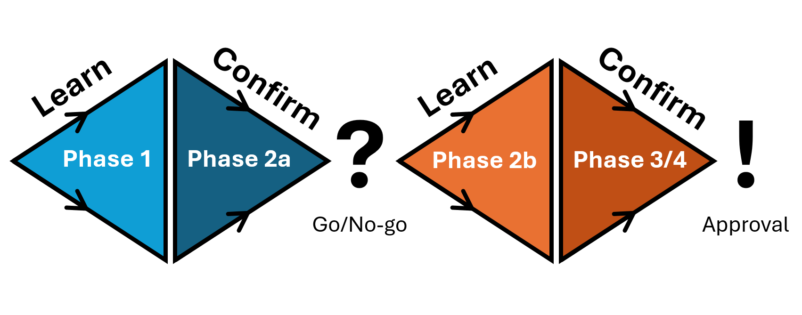
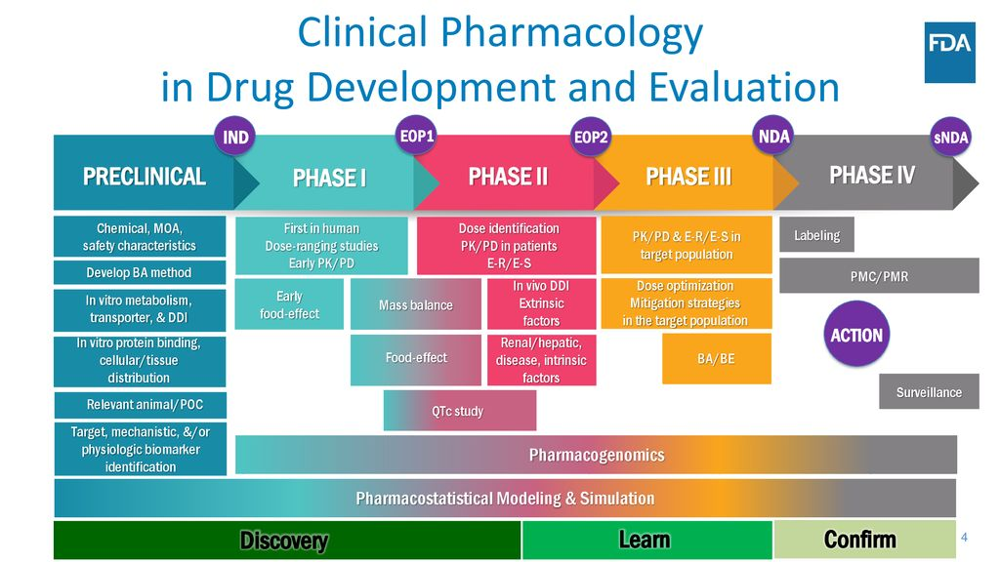
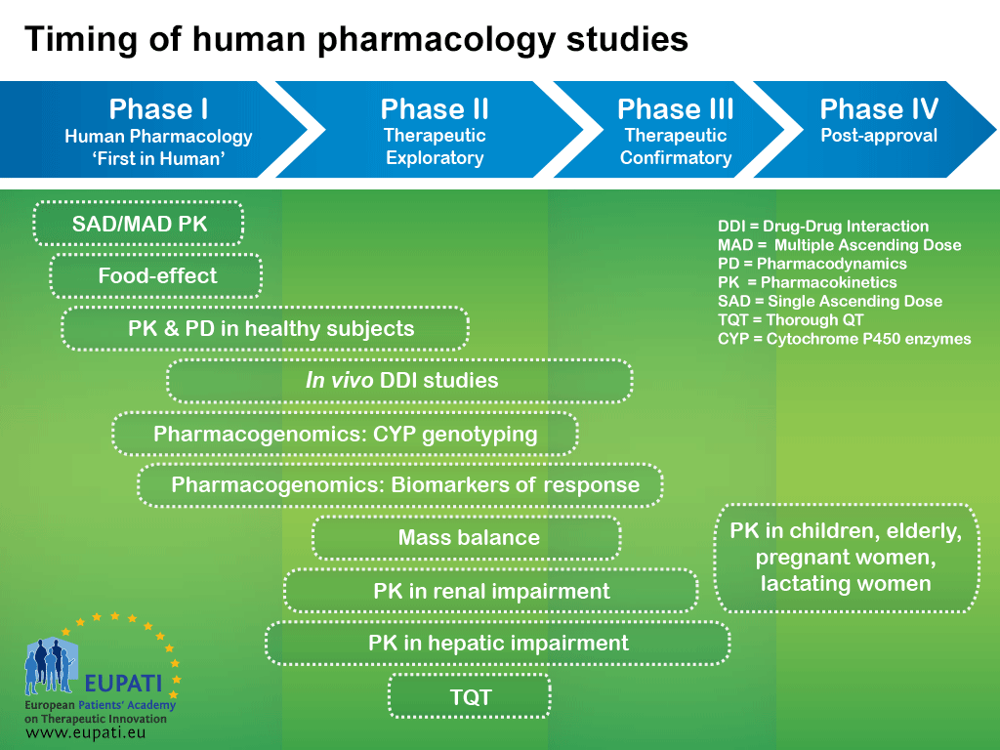

::: {.callout-caution title="Under construction"}

* How can Modeling help in each phase?

:::

The clinical pharmacology strategy must be tailored to the molecule's properties:

* Size: Small molecule vs. antibody vs. peptide vs. oligonucleotide
* Target/mechanism of action
* Disease and patient population
* Co-medications (any that are common in the target population?)
* Safety profile
* Formulation (e.g., oral vs. parenteral)
* Commercial product vision

A *Target Product Profile* (TPP) should guide all clinical pharmacology decisions from the start.

## General clinical study design

* **P**opulation
  * Inclusion/Exclusion criteria
  * Number of subjects (sample size)
* **I**ntervention
  * What is given (Drug/Food, Formulation, Dose), when (regimen), and how (route)?
  * Randomization and balance between arms
  * Blinding
  * Adaptive, cross-over/parallel-group (Study type)
* **C**ontrol
  * What is the control group?
  * Placebo, standard-of-care, active comparator?
* **O**utcome
  * What is being measured (Covariates, PK, Clinical/pharmacological outcomes), when (Sampling/visit schedule, baseline and/or time-varying), and how?
* **T**ime
  * For how long does the study continue?
  * Run-in, active treatment, washout, and follow-up periods

::: {.callout-tip}

If a cross-over design with a washout period is used, always check that the predose concentration of the second dose is BLQ.

:::

## Phases of drug development

### A short history of clinical trial "phases"

Prompted by the thalidomide tragedy, the 1962 *Kefauver-Harris Amendments* to the *U.S. Federal Food, Drug, and Cosmetic Act* introduced a "proof-of-efficacy" requirement.
This led the FDA to introduce structured "phases" in clinical research, describing the progression from First-in-Human trials to confirmatory pivotal trials.

Previously, drug companies only had to show their new products were safe.
The way drugs were investigated, a physician from the company would go out in the community with some samples and say to the doctor, "I've got this new drug for so-and-so. Here are some samples. Try it out and let us know how you like it".
They would then receive a letter from him stating, "I tried it out on eight patients, and they all got along fine."

### An overview of clinical trial "phases"

Most clinical pharmacology studies are Phase 1 studies, during which we **learn** about the drug's PK.
In Phase 2, we **learn** about the PD of the drug.
In Phase 3, we **confirm** our efficacy and safety hypotheses in the target population.

George Box views scientific progress as consisting of and requiring alternating steps of induction and deduction: the former is learning from experience, and the latter confirms what has been learned.
A simplified application of this view to clinical drug development would break development into two learn-confirm cycles @fig-cycles.

{#fig-cycles}

* First cycle (Proof-of-Concept)
  * Phase 1: **Learn** what is the tolerated dose? (Max tolerated dose?)
  * Phase 2a: **Confirm** that this dose has the promise of efficacy in a selected group of patients. (Is that dose efficacious?)
* Decision point: Is there a sufficiently positive indication of efficacy (and lack of toxicity) to justify further development? (Go/No go)
* Second cycle
  * Phase 2b: **Learn** how to use the drug in representative patients to make acceptable benefits/risks likely. (Effect on patients?)
  * Phase 3/4: **Confirm** in a large and representative patient population that acceptable benefit/risk is achieved. (Acceptable B/R-ratio?)
* Approval is granted.

{#fig-clinpharm-studies}

{#fig-pharmacology-studies}

### Phase 1: Human pharmacology

Primary objective: **safety and tolerability**.

Secondary: **characterize PK profile** (single and repeated dosing), PD/biomarker readout (to predict therapeutic dose range), and establish a dose range.
Need to reach exposures **higher than therapeutic** to account for potential DDI and organ impairment scenarios later.

Data from Phase 1 studies are typically well-controlled and provide clean SDTM input datasets.

#### 👨‍⚕️ First-in-human (FIH) PK

Single ascending dose (SAD) and multiple ascending dose (MAD) studies in healthy volunteers.
Starting dose from nonclinical data (NOAEL/MABEL); dose escalation typically 2--3 fold; sentinel dosing (2 subjects first).
Typical cohort: 6 active + 2 placebo.
Intensive PK sampling (plasma + urine; >3--5 half-lives), ECGs, PD biomarkers, safety labs, genotyping.
See the [FIH subpage](fih/index.qmd) for details on dose selection, escalation, sampling, and study design.

#### 🍝 Food effect (for oral drugs)

Crossover study (fed vs. fasted) to characterize the effect of food on PK.
Structurally a type of relative BA study -- no predefined acceptance criteria.
Can be included as a cohort within FIH or run standalone.
See the [BA/BE subpage](ba-be/index.qmd#food-effect-studies) for details.

### Phase 2: Therapeutic exploratory

Phase 2/3 studies are performed on patients and often consist of separate study parts/cohorts to investigate multiple scenarios (e.g. different patient populations) in one study.
In most cases, PD measurements will be part of the analysis (and should be included in the analysis dataset to enable PK-PD evaluations).
The study design can be very diverse.
Phase 2/3 studies are less controlled than Phase 1, resulting in unrecorded dosing times, missing laboratory measurements, etc.

#### ☢️ Mass Balance/ADME

Single-dose, open-label, radiolabeled (^14^C) study in ≥6 healthy subjects.
Determines routes/rates of elimination, clearance mechanisms, and circulating metabolites.
Common in Phase 2b; ≥12 months lead time required.
See the [Mass Balance subpage](mass-balance/index.qmd) for details on radiolabeling, collection criteria, MIST, and study outputs.

#### 🤒 Healthy vs Patient PK/PD

* Proof-of-Concept (PoC)

#### 📈 Dose-response

* Typically, randomized parallel group studies.
* Three or more dosage levels, one of which may be zero (placebo).
* Including one or more doses of an existing medicine as a control may also be helpful.
* As a rule, PoC is tested at the maximum tolerated doses (MTD) or the maximal administered dose if MTD was not defined.
* Identify a reasonable starting (minimum effective) dose, ideally with specific adjustments.
* Identify response-guided stepwise dose adjustment (titration) and the intervals at which they should be taken.
* Identify a dose, or a response (desirable or undesirable), beyond which titration should not ordinarily be attempted because of lack of further benefit or an unacceptable increase in undesirable effect.
* Identify optimal dose.

### Phase 3: Therapeutic confirmatory

By Phase 3, the clinical pharmacology development is largely complete.
All preceding studies (FIH, DDI, organ impairment, BA/BE, mass balance, QT, etc.) have informed the dose, formulation, and labeling strategy.
The pivotal trial provides the **conclusive evidence** of efficacy and safety in the target population at the final dose.

PK sampling is typically sparse (population PK).
Phase 3 data characterizes PK in the target population and feeds the regulatory submission and labeling:

* PK parameters for the label: half-life, clearance (CL), volume of distribution (V~d~), bioavailability (F).
* Exposure-response relationships for efficacy and safety.
* Covariate effects (body weight, age, sex, race, organ function, concomitant medications).
* Data feeds CTD Module 2.7 and SmPC/labeling (sections 4.2 and 5.2).

PK is seldom a reason for regulatory rejection.
If the benefit/risk ratio (efficacy/safety) is positive, it is usually grounds for approval.

### Phase 4: Post-approval

* Post-marketing commitments/requirements (PMC/PMR).
* Studies in new indications or new populations.
* Label updates based on real-world data.
* Safety surveillance.

### Studies spanning multiple phases

#### 💊+💊 Drug-drug interaction (DDI) *in vivo* (Phase 1--3)

Evaluates how the drug under investigation affects or is affected by co-administered drugs.
Two study types: **object drug** (own drug's PK affected by inhibitor/inducer) and **precipitant drug** (own drug affects probe substrate PK).
Endogenous biomarkers and pharmacogenomics can sometimes replace dedicated clinical studies.
See the [DDI subpage](ddi/index.qmd) for details on study design, probe selection, and alternatives.

#### 💊=💊 Bioavailability (BA) and bioequivalence (BE) (Phase 1--post-approval)

Formulation bridging studies with increasing confidence as development progresses.
**Relative BA** (early development): effect estimation, no predefined boundaries.
**Bioequivalence** (pivotal/post-approval): 90% CI of GMR within 0.80--1.25.
See the [BA/BE subpage](ba-be/index.qmd) for details on study design, fasted/fed requirements, and biowaivers.

#### 💓 (T)QT study (Phase 1--2)

Regulatory requirement (ICH E14) to assess QT prolongation risk for all small molecules with systemic exposure.
Large targeted proteins and mAbs are generally exempt.
Options range from a standalone Thorough QT (TQT) study, to Concentration-QTc (C-QTc) modeling built into SAD/MAD, to a "double negative" waiver (negative hERG + negative in vivo CV).
See the [QT prolongation subpage](qt/index.qmd) for details.

#### 🧬 Pharmacogenomics (all phases)

Genotyping of drug-metabolizing enzymes (e.g. CYP2D6, CYP2C19) and transporters (e.g. OATP1B1) throughout development.
Used to explain PK variability, identify poor/rapid metabolizers, inform dose adjustments, and can sometimes replace dedicated DDI studies.
Samples are typically collected in FIH and carried forward into later phases.

#### 🚮 Organ impairment PK (Phase 2--3)

Parallel-group studies in subjects with varying degrees of organ impairment vs. matched healthy controls.
Full, reduced, or adaptive/staggered designs.
Measure unbound drug if high protein binding; include PD markers when possible.

* [Renal impairment (RI)](renal-impairment-studies/index.qmd) -- classified by GFR; required when f~e~ >30% (FDA), but even non-renally cleared drugs should consider severe RI.
* [Hepatic impairment (HI)](hepatic-impairment-studies/index.qmd) -- classified by Child-Pugh (or NCI-ODWG in oncology); required when hepatic elimination >20% (FDA).

#### 👩‍👦 Special populations (Phase 3--4)

PK studies in populations not adequately represented in the main clinical program.
Often required for regulatory approval even if the primary indication is in adults.

* Pediatrics -- required if seeking an adult indication (pediatric investigation plan / IPSP).
* Elderly
* Pregnant
* Lactating -- required even for large molecules.
* Obese
* Ethnic bridging (Japanese/Chinese PK) -- see [FIH subpage](fih/index.qmd) for ethnic PK requirements.

## References

* <https://www.wma.net/policies-post/wma-declaration-of-helsinki/>
* <https://www.ich.org/page/efficacy-guidelines>
