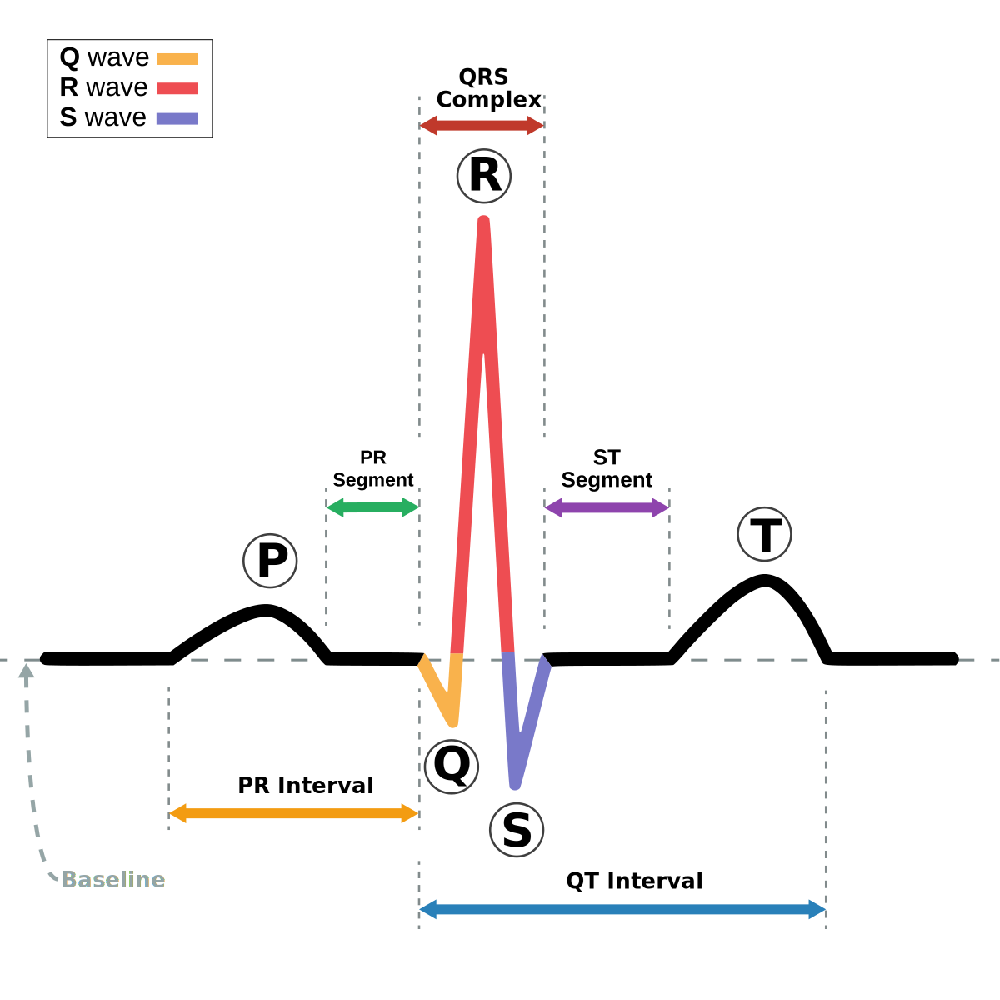

The cardiac conduction system (CCS, also called the electrical conduction system of the heart) transmits the signals generated by the sinoatrial node---the heart's pacemaker, to cause the heart muscle to contract, and pump blood through the body's circulatory system.

* **PQ-interval**: Time it takes before the signal has passed the atrioventricular (AV) node.
* **QRS-complex**: depolarization of the chambers.
* **ST-segment** and **T-wave**: repolarization of the chambers (return to "normal").

## Causes of QT-prolongation

* Drug inhibition of ion-channels in the heart
* Genetics (hereditary)
* Hypocalcemia, hypomagnesia

* Can in rare cases lead to fainting or death through **torsades de pointes (TdP)**, french for "twisting of peaks".

::: {.callout-note}
QT-prolongation ≠ risk for TdP

There are more factors needed for TdP, e.g. "early afterdepolarizations".
:::

* QT-time is affected by heart rate: Corrected QTc-time (Bazetts and Fridericia's formulas)

$$
\begin{aligned}
& \mathrm{QTc}_\text{Bazett} = \frac{\mathrm{QT}}{\sqrt{HR}} \\
& \mathrm{QTc}_\text{Fridericia} = \frac{\mathrm{QT}}{\sqrt[3]{HR}}
\end{aligned}
$$

## Thorough QT/QTc (TQT) study

* According to ICH E14 (2005), *in general*, all drugs shall perform a thorough QT/QTc study early in development.
  * Large targeted proteins and monoclonal antibodies have a low likelihood of direct ion channel interactions and a thorough QT/QTc study is generally not necessary. (QA 2015)

* The threshold level of regulatory concern, is around **5 ms** as evidenced by an upper bound of the 95% confidence interval around the mean effect on QTc of **10 ms**
* Drugs that prolong the mean QT/QTc interval by **>20 ms** have a substantially increased likelihood of being proarrhythmic

### How to perform the study

* Randomized, **double-blind**, **placebo- and positive-controlled** (typically moxifloxacin), **crossover** in **healthy volunteers**.
* **Dosing**: Therapeutic and supratherapeutic doses (usually 2--3 fold higher exposure, AUC and/or C~max~).
* **Sample size**: 40--60 subjects, dependent on variability and crossover design.
* **Endpoint**: Change from baseline in QTc (QT interval corrected for heart rate), using time-matched comparisons.
  Upper bound of the two-sided **90% CI** for the mean difference vs. placebo must be **below 10 ms**.
* Timing of ECG collection and study design (single or multiple dose, duration) should be guided by PK.
  For drugs with short half-lives and no metabolites, a single dose study might be sufficient.
* Studies should characterize the effect of a drug on the QT/QTc throughout the dosing interval.
* Dose-response and generally the concentration-response for QT/QTc prolongation should be characterized.
* The QT/QTc interval data should be presented both as analyses of central tendency (e.g. means, medians) and categorical analyses.

## Concentration-QTc (C-QTc) study

A well-designed and conducted QTc assessment based on C-QTc modeling in early phase 1 studies can be an alternative approach to a thorough QT study for some drugs to reliably exclude clinically relevant QTc effects.

Aim is to assess drug effect on heart repolarization (same as a TQT-study).
A C-QT study can be smaller than a TQT-study, since all data from all doses can be used.
Does not need to be a separate dedicated study.
Can measure e.g. ECG during Phase 1.

### How to perform the study

Usually done early (Phase 1), to answer the question "what intensity of ECG-monitoring is needed in later phases?"

SAD/MAD data are well suited for early assessment of C-QTc.

* **Frequent Holter ECGs** matched with PK sampling, especially around C~max~.
* Must cover an adequate (supratherapeutic) exposure range and be prespecified with reliable analysis.
* Must account for DDI and hepatic impairment worst-case exposures.
* Sample size -- usually 4--8 persons per dose cohort + 2--4 persons getting placebo.
  * Placebo makes it possible to rule out small QTc effects, allows detection of circadian rhythms in QTc data.
* Baseline ECG.
* Positive control is usually missing -- demands the study of high exposures.
  * 2 times maximal therapeutic exposure.
* Data from several studies are not recommended where bias can be introduced.

## "Double negative" waiver

If the in vitro **hERG assay** and in vivo **cardiovascular study** (e.g. telemetry) are both negative, a clinical QT study may be waived entirely.
Requires health authority agreement.

## References

::: {#refs}
:::
