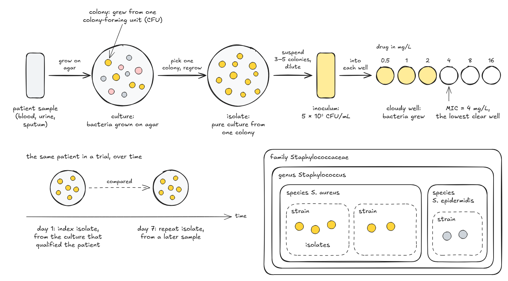

## What are bacterial infections?

For an infectious agent, **infectivity** refers to the proportion of exposed persons who become infected.
**Pathogenicity** refers to the proportion of infected individuals who develop clinically apparent disease.
**Virulence** refers to the proportion of clinically apparent severe or fatal cases.
The disease process may never progress to clinically apparent illness or result in illness that ranges from mild to severe or fatal. This range is called the **spectrum of disease**.
Ultimately, the disease process ends in recovery, disability, or death (see @fig-periods).

A bacterial infection is classified according to the site of infection and sometimes also the source of infection (see @fig-overview). Some examples include:

* Skin infections
  * Acute bacterial skin and skin structure infection (ABSSSI)
* Lung infections
  * Community-acquired pneumonia (CAP)
    * Probably *Streptococcus pneumoniae*, *Haemophilus influenzae*, *Mycoplasma pneumoniae*)
  * Hospital-acquired/ventilator-associated pneumonia (HAP/VAP)
    * Probably *S. aureus*, *Pseudomonas aeruginosa*, *Enterobacteria*
    * *Pseudomonas aeruginosa* lives in moist hospital environments such as sinks and shower heads, and can also colonize the gut. It mainly infects vulnerable patients, such as those on ventilators, with burns or with weakened immune systems, and earlier antibiotic treatment raises the risk.
* Intra-abdominal infection (IAI)
* Blood-stream infection (BSI)
* Urinary-tract infection (UTI)

{#fig-overview}

### Sepsis

Sepsis is a life-threatening state.
Respiratory tract infections, especially pneumonia (including HAP and VAP), are its most common source, but infections of the urinary and genital tract (genitourinary infections) are among its sources too [@mayrEpidemiologySevereSepsis2014].

The Sequential Organ Failure Assessment (SOFA) score is often used to assess organ failure in septic patients.

#### Septic shock

Septic shock is a development of sepsis that is even more severe.

## Symptoms

### Periods of disease

The progression of an infectious disease can be divided into five periods, which are related to the number of pathogen particles and the severity of signs and symptoms (@fig-periods).
Infectious diseases can be contagious during all five of the periods of disease.

|   #   | Period/Phase/Stage | Description |
| :---: | :----------------- | :---------- |
|   1   | Incubation/latency | Pathogen replicates. No signs or symptoms. |
|   2   | Prodromal (subclinical disease) | Pathogen replicates. General signs and symptoms. The immune system is active. |
|   3   | Illness (clinical disease) | Most severe and characteristic signs and symptoms. **Usual time of diagnosis is early in this period.** |
|   4   | Decline            | Pathogen particle-count declines. Signs and symptoms improve. Immune system possibly weakened---susceptibility to secondary infection. |
|   5   | Convalescence      | Patient returns to normal function. Signs and symptoms resolve. Some permanent damage might have occurred. |

: Periods of disease. {#tbl-periods-of-disease tbl-colwidths="[10,20,70]"}

Stages might overlap.
The onset of symptoms marks the transition from subclinical to clinical disease.

{#fig-periods}

## Diagnosis

{#fig-biomarkers}

* Biomarkers not specific
    * 3 markers + white blood cell count (WBC, but unspecific)
        * C-reactive protein (CRP, comes late)
        * Procalcitonin (PCT, quicker than CRP)
        * IL-6
* Broth microdilution susceptibility testing (microbroth)
    * Accurate + expensive
* Vitek (automated susceptibility testing by turbidity)
    * Not as accurate as microbroth
* MALDI-TOF (mass spectrometry)
    * Identifies the species quickly, but does not test susceptibility

In the laboratory, bacteria are grown in broth, a liquid growth medium, or on agar plates, which hold a solid growth medium.
On agar, a cell that divides again and again gives a heap of cells visible to the eye (a colony), although two cells that land on the same spot, or a clump of cells, also give a single colony [@daveyLifeDeathInbetween2011].

A pure culture grown from a single colony is called an isolate, and it usually descends from a single bacterium.
Below the species, a strain is a set of genetically similar descendants of one colony or cell, although the word is often used loosely.
In classic microbiology, a subspecies is a named group of strains within one species that differ from the rest genetically or in their observable traits, such as *Bacillus subtilis* subsp. *subtilis*.
In medicine and epidemiology, bacteria are also grouped by the molecules on their cell surface (antigens) into serotypes, or serovars, and different strains can share a serotype.
The type strain of a species is the living culture its name is tied to, descended from the isolate used to describe the species [@vanrossumDiversityWithinSpecies2020].
The name of a species includes its genus, so *Staphylococcus aureus* is a species of the genus *Staphylococcus*.
Species are grouped into genera, genera into families, families into orders and orders into classes, up to the domain [@parteListProkaryoticNames2020].

An isolate from a patient's sample is a clinical isolate.
PK/PD studies are recommended to test several clinical isolates alongside a reference strain, kept in a culture collection such as the American Type Culture Collection (ATCC) and used throughout to show that results are reproducible [@bulittaGeneratingRobustInformative2019].
In the protocol of one antibiotic trial, the index isolate is the one from the culture that qualified the patient for the trial, and repeat isolates from later samples are kept alongside it for analysis [@dicksteinMulticentreOpenlabelRandomised2016].

An isolate is wild type for a drug when it has no resistance to that drug gained through mutation or from other bacteria (acquired resistance) [@moutonMICbasedDoseAdjustment2018], so the same isolate can be wild type for one drug and resistant to another.
How the MICs of wild-type isolates spread, and where the epidemiological cut-off falls, is covered under [antibacterials](../../../pharmacopeia/atc/j/j01/index.qmd#resistance-measurement-mic).

::: {#fig-culture-to-mic}

{fig-alt="Hand-drawn diagram in three parts. Top: a sample tube, an agar plate with mixed colonies of three colors, a plate with only golden colonies labelled isolate, a tube of cloudy suspension labelled inoculum, and a row of six wells with drug concentrations from 0.5 to 16 mg/L, the first three cloudy and the rest clear, with the MIC at 4 mg/L. Bottom left: two plates of golden colonies on a time axis, the index isolate on day 1 and a repeat isolate on day 7. Bottom right: nested boxes, family Staphylococcaceae containing genus Staphylococcus, containing the species S. aureus and S. epidermidis, each containing strains drawn as dashed boxes with dots for isolates."}

From a patient sample to an MIC (top), the same patient in a trial over time (bottom left), and where an isolate belongs among strains, species, genus and family (bottom right).
The golden colonies are *Staphylococcus aureus* throughout.
The inoculum follows the broth microdilution protocol of Wiegand et al. [@wiegandAgarBrothDilution2008], and the classification is from LPSN [@parteListProkaryoticNames2020].

:::

## How can it be treated?

> "Hit hard and hit early" (paraphrasing Paul Ehrlich)

The rules of thumb below come from clinical practice: they are empirical guidance, not findings from a single study.

In almost all cases, a treatment chosen before the bacteria are identified (empirical treatment) is used first.
There is no time to wait for culture results.
The "right" treatment is 90% successful, and the "wrong" treatment is 60% successful (known as the **"90/60 rule"**).

Most infections can be treated in 5--7 days.

### What we want to know before treating an infection

1. Probable infection source
    * History
    * Examination (lab tests, X-ray, CT-scan)
2. Probable bacteria & antibiotic susceptibility (see e.g. @fig-overview)
    * Medical training
    * Local epidemiology
    * Resistance rates: How many percent are resistant?
      * Six often-resistant hospital pathogens (ESKAPE)
3. Individual risk of resistant bacteria
    * Previous infection with resistant bacteria
    * Recent travel
    * Hospitalization or antibiotics
4. Other considerations
    * Allergy
    * Other drugs (interaction risk)
    * Other diseases (co-morbidities)
    * PK

* Clinical dogmas: Infection of an implant or other foreign object (foreign body infection) -> bacteria growing in a protective slime layer on its surface (biofilm)
* Immunosuppressive

### Resistance

::: {.callout-important title="The patient is not resistant"}
Antibiotic resistance belongs to the bacteria, not to the patient.
It is the bacteria that do not respond to the antibiotic [@whoAntimicrobialResistance2026], so a patient is never "resistant"; they are infected with, or carry, resistant bacteria.
:::

Resistant bacteria travel through food, water, global trade, or human travel.
How bacteria become resistant, and how resistance is handled in PK/PD, is covered under [antibacterials](../../../pharmacopeia/atc/j/j01/index.qmd#resistance).

### After initial treatment

* Treatment re-evaluation after 3 days
    * 48 hours needed to evaluate antibiotic efficacy
    * The efficacy of antibiotic treatment is judged by **signs and symptoms** (Are you feeling better than yesterday?), and the course of **inflammatory markers** (WBC, CRP, PCT)
* Empiric treatment should ideally be switched to targeted therapy once culture results are available (2--3 days)

## Clinical studies

### Clinical pharmacology studies

During an active infection, the volume of distribution of a drug may rise considerably and then fall quickly as the patient recovers, so its plasma concentrations can change markedly over the course of treatment.
The European Medicines Agency (EMA) ties the [PK/PD target](../../../pharmacopeia/atc/j/j01/index.qmd#index-based-approaches) used to choose the dose to the infection: for potentially life-threatening infections that usually carry a high bacterial load and rarely resolve on their own, such as HAP/VAP, it generally expects the target for at least a tenfold (1-log~10~) fall in the bacterial count, whereas for infections with a lower load or also treated by other means, such as some ABSSSI and IAI where surgery is often used, the target for no net change in the count (stasis) may be enough.
Drug concentrations in the fluid lining the airways (epithelial lining fluid, ELF) and in the fluid around the brain and spinal cord (cerebrospinal fluid), which the EMA asks for when a drug is meant to treat pneumonia or meningitis ([antibacterials](../../../pharmacopeia/atc/j/j01/index.qmd#resistance-measurement-mic)), typically come from uninfected patients, each given a single dose at a set time before a scheduled airway examination (bronchoscopy) or spinal tap (lumbar puncture), although some ELF data from infected patients are encouraged [@emaGuidelineUsePharmacokinetics2016].

## References

::: {#refs}
:::
