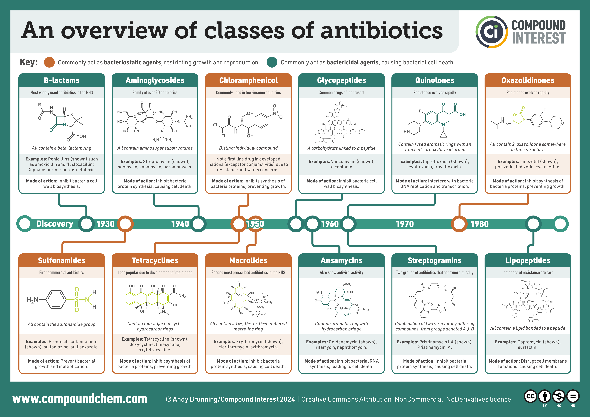
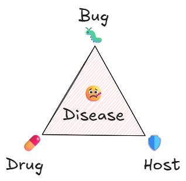

::: {.callout-caution title="Under construction"}
* Time-kill *in vitro*
* *in vivo* models
  * Mouse thigh/lung
    * Neutropenic or immuno-competent
  * Dose fractionation
  * 1 CFU per animal (homogenization)
* Nielsen model (growing susceptible and resting insusceptible states)

* ABX C_T should be high enough.
:::

Antibacterials are drugs used to treat bacterial infections.
We often use the words *antimicrobials*, *antibacterials*, and *antibiotics* for these compounds.
They are similar terms, but each has a specific meaning:

* **Antimicrobials** target all kinds of microorganisms, such as bacteria, fungi, viruses, and protozoa.
* **Antibacterials** only act on bacteria. In the broad sense they include both antibiotics and some common disinfectants, but ATC J01 holds only those used to treat infections inside the body.
* **Antibiotics** are **naturally produced** by microorganisms and kill or inhibit other microorganisms, mainly bacteria.

The term "antibiotic" comes from the Greek words *anti* ("against") and *biotikos* ("concerning life").
Strictly speaking, antibiotics refers only to naturally produced substances, and not synthetic or semi-synthetic types (e.g., quinolones).
However, it is commonly used interchangeably with antibacterials.

{#fig-abx-classes}

## How do antibacterials work?

Antibacterials interfere with vital processes in bacterial cells.

* **Bactericidal** antibacterials kill bacteria.
* **Bacteriostatic** antibacterials prevent bacteria from multiplying.

The host's immune system then clears the remaining infecting pathogens.

The traditional paradigm in severe infection is the interaction between the bug and the drug, and its central fallacy is that it misses the role of the host.
PK/PD ties all three together: how the host metabolizes the drug, how the drug reaches the target site, how it kills the bacteria, and how susceptible the pathogen is to it [@shorrAntibioticsCriticallyIll2012].

::: {#fig-triangle}

{fig-alt="A triangle labelled Bug at the top vertex, Drug at the lower left and Host at the lower right, with Disease in the shaded centre."}

The bug, drug, host triad.
Antimicrobial pharmacodynamics is usually framed as the bug-drug interaction, but the host determines both the exposure achieved and how much killing the drug has to do.

:::

The host side matters in practice.
In a study of critically ill patients given empirical β-lactams, 42% had initial trough concentrations below the minimum inhibitory concentration (MIC); where measured creatinine clearance was ≥130 mL/min/1.73 m^2^ that figure was 82% [@udySubtherapeuticInitialLactam2012].
This is the host vertex of @fig-triangle, and it has its own page: [augmented renal clearance](/docs/concepts/pk/augmented-renal-clearance/).

### Antibiotic targets in bacteria

Different classes of antibacterials act on different parts of bacterial cells.
They mainly target:

1. The cell wall or membranes surrounding the cell.
2. The DNA and RNA production machinery.
3. The protein production machinery (ribosomes and related proteins).

Human cells have no cell wall of this kind, and their versions of the other two differ from the bacterial ones, so antibacterials typically do not harm our cells.
However, side effects can still occur.

### Narrow-spectrum and broad-spectrum antibacterials

Some antibacterials have a **narrow** spectrum, meaning they act on only certain groups of bacteria.
Others are **broad** spectrum and affect many bacterial species.
Narrow-spectrum antibacterials are often preferred since they leave non-disease causing bacteria alone.
However, broad-spectrum antibacterials are sometimes used when doctors are unsure of the exact bacteria causing the infection, as in [empirical treatment](../../../../pathology-primers/bacterial/bacterial-infection/index.qmd#how-can-it-be-treated).

## Resistance

Antibiotic resistance is a bacterium's ability to survive the effects of an antibiotic.
In the presence of the antibiotic, resistant bacteria live and multiply.
Clinically, resistance means the bacterium can grow at drug exposures reached during standard treatment, leading to treatment failure.

Bacteria gain resistance through:

1. **Mutations** in their own DNA.
2. **Horizontal gene transfer**, where they acquire DNA from other bacteria.

If the new trait offers an advantage, the bacterium may pass it on to future generations or spread it through horizontal transfer.

Terms for resistance to several drug classes, as standardized by an international expert proposal [@magiorakosMultidrugresistantExtensivelyDrugresistant2012]:

- **MDR** (multidrug-resistant): non-susceptible to ≥1 agent in ≥3 antimicrobial classes
- **XDR** (extensively drug-resistant): non-susceptible to ≥1 agent in all but 2 or fewer classes
- **PDR** (pandrug-resistant): non-susceptible to *all* agents in *all* classes

### Resistance measurement: MIC

The minimum inhibitory concentration (MIC) is the lowest concentration that prevents visible growth of a standard number of bacteria (inoculum) after 18 ± 2 h, tested in two-fold dilutions (0.5, 1, 2 mg/L and so on).
Growth only becomes visible at about 10^7^ to 10^8^ colony-forming units (CFU) per mL, so the MIC is not a strict minimum but the lowest concentration where no growth can be seen, and it cannot be compared directly with a drug concentration in the patient [@moutonMICbasedDoseAdjustment2018].

In broth microdilution, a plate of small wells holds broth with the drug in a two-fold dilution series, and every well receives the same inoculum, 5 × 10^5^ CFU/mL.
How a patient's sample becomes an inoculum is sketched in the [bacterial infection primer](../../../../pathology-primers/bacterial/bacterial-infection/index.qmd#fig-culture-to-mic).
A well without drug checks that the bacteria grow (growth control), and a well without bacteria checks that the broth is sterile (sterility control).
After incubation, a well with growth is cloudy (turbid) or has a sediment at the bottom, and the MIC is read by eye, with a mirror if it helps, as the lowest concentration in a clear well (@fig-mic-plate); an automated reader or camera must be calibrated to manual reading.
Some drug and species combinations give endpoints that fade over two or three wells, and a few drugs have their own reading rules: for drugs that stop growth without killing (bacteriostatic), such as the tetracyclines (J01AA) and linezolid (J01XX08), tiny specks of sediment (pinpoint growth) are ignored when growth trails off, and trimethoprim (J01EA01) is read at the lowest concentration that inhibits at least 80% of growth [@eucastReadingGuideBroth2024].
A larger inoculum can raise the MIC, especially when the bacteria make an enzyme that destroys the drug, as β-lactamase producers do with β-lactams [@wiegandAgarBrothDilution2008].

::: {#fig-mic-plate}

{fig-alt="A 96-well plate seen from above. Each of the 12 columns holds a different antibiotic, named at the top, with its highest concentration in mg/L printed in the top well. Wells are either clear or cloudy yellow, and the cloudy wells gather towards the bottom of the plate. Red dots sit on some wells."}

Broth microdilution plate for *Pseudomonas aeruginosa*.
Each column is one antibiotic, starting at the concentration printed in the top row and halving with each row down; cloudy yellow wells show growth.
For piperacillin (column 2) the wells are clear down to 4 mg/L and cloudy from 2 mg/L, so the MIC is 4 mg/L.
Red dots mark clinical breakpoints (explained below); each column's range brackets its drug's breakpoint, which is why the columns start at different concentrations.
Cropped from ["Pseudomonas aeruginosa antibiotic susceptibility testing"](https://commons.wikimedia.org/wiki/File:Pseudomonas_aeruginosa_antibiotic_susceptibility_testing.jpg) by HansN., licensed under [CC BY-SA 4.0](https://creativecommons.org/licenses/by-sa/4.0/).

:::

A colony-forming unit is whatever gave rise to one colony on an agar plate: usually a single bacterium, but possibly two cells that landed together or a clump of cells, so the count is of units, not cells.
Only bacteria that can grow on the plate are counted, so plate counts often underestimate how many are alive [@daveyLifeDeathInbetween2011].
To count them, a sample is diluted in steps of ten, a fixed volume of each dilution is spread on a plate, and after incubation the colonies on a plate with a countable number are scaled back up by the dilution (@fig-cfu-plates).

::: {#fig-cfu-plates}

{fig-alt="Four agar plates side by side, labelled with dilution factors from 10^-4 to 10^-7. The first plate is crowded with small colonies, the second has several dozen, the third a handful and the last only a few."}

Colonies grown from ten-fold dilutions of yogurt containing *Lactobacillus casei*, with the dilution below each plate; the more dilute the sample, the fewer the colonies.
["Serial Dilutions"](https://commons.wikimedia.org/wiki/File:Serial_Dilutions.png) by Eunice Laurent, licensed under [CC BY-SA 4.0](https://creativecommons.org/licenses/by-sa/4.0/).

:::

The inoculum is set by turbidity and dilution and checked only afterwards, by plating a sample from the growth control well immediately after inoculation; the test is valid only if that count is right.
For scale, the turbidity standard used to set up the inoculum (0.5 McFarland) matches 1 to 2 × 10^8^ CFU/mL, so a well that starts at 5 × 10^5^ CFU/mL has to multiply 20- to 200-fold before its growth becomes visible.
Where the inoculum is instead grown from an overnight broth culture, an option outside the CLSI and EUCAST methods, the link between turbidity and colony count has to be calibrated by plating for each isolate, because such a culture may be less viable than a freshly grown one, which makes a turbidity reading alone unreliable [@wiegandAgarBrothDilution2008].

The reference method requires this count for every isolate and aims for 5 × 10^5^ CFU/mL, within a target range of 2 to 8 × 10^5^ CFU/mL.
The dilution needed depends on the species, the number of live bacteria in the final inoculum depends on the growth phase of the culture, and colony counts in preliminary tests may call for a different dilution [@isoSusceptibilityTestingInfectious2019].
In one laboratory study, the meropenem (J01DH02) MIC of carbapenem-resistant Enterobacterales could differ 8-fold between the two ends of that range, enough to change the susceptibility category of some isolates, whereas the MIC of susceptible isolates rose only when the inoculum was more than 10 times the target [@smithInoculumEffectEra2018].

Strains without acquired resistance (the wild type) usually span three to five dilutions; the top of that range is the epidemiological cut-off (ECOFF).
Repeat tests of one strain scatter too, with a standard deviation of about 0.3 to 0.5 of a dilution within a laboratory and 0.5 to 1 between laboratories.
PK/PD targets come from many strains with repeatedly measured MICs, so the targets are reasonably accurate, but applying one to a single MIC from a patient's isolate is not: an error of two dilutions changes the exposure needed 4-fold [@moutonMICbasedDoseAdjustment2018].

In a study of linezolid (J01XX08) against *Staphylococcus aureus*, 22 strains were each tested four times, blinded, in five laboratories.
The 95% interval of all results reached about 1.3 dilutions from the mean, and the 99% interval two; differences between strains, between laboratories and within one laboratory all contributed, and four repeats could not reliably tell the strains apart [@moutonVariationMICMeasurements2018].

A clinical breakpoint is an MIC that sorts an isolate into a category that guides treatment.
EUCAST, the European committee that sets breakpoints, uses three: susceptible at a standard dose (S); susceptible, increased exposure (I), when treatment is likely to work because a higher dose or the drug's concentration at the site of infection raises the exposure; and resistant (R), when treatment is likely to fail even with increased exposure.
Exposure here is what reaches the bacteria at the site of infection, which depends on the route, dose, dosing interval, infusion time, distribution and excretion of the drug [@eucastDefinitionSIR2019].
Breakpoints are set from the MIC distributions of the relevant species, the drug's PK/PD and clinical outcome data [@wiegandAgarBrothDilution2008].
PK/PD relationships are usually described with unbound serum concentrations as a stand-in for the site of infection [@moutonMICbasedDoseAdjustment2018].
For a drug meant to treat infections outside the blood, the EMA asks developers for concentrations at that site too: in urine for urinary tract infections, in the fluid lining the airways (epithelial lining fluid) for pneumonia, and in the fluid around the brain and spinal cord (cerebrospinal fluid) for meningitis [@emaGuidelineUsePharmacokinetics2016].

::: {.callout-tip title="Reading an MIC result"}
- One MIC reading is uncertain: repeat tests of one strain scatter with a standard deviation of up to half a dilution within a laboratory, and up to one dilution between laboratories.
- Check that the inoculum was counted, above all for a β-lactamase producer tested with a β-lactam, where a larger inoculum can raise the MIC.
- Whether the isolate is wild type is a comparison with the ECOFF.
- The treatment category (S, I or R) is a comparison with the clinical breakpoint for that drug and species, and the exposure it refers to is exposure at the site of infection.
- The MIC is not a drug concentration in the patient, and a single MIC is a poor basis for an individual dose: an error of two dilutions changes the exposure needed 4-fold.
:::

## Translating antibiotic PKPD

Preclinical antibiotic studies provide essential PKPD information to help select effective clinical dosing regimens.
There are two main approaches:

### Index-based approaches

The classical method links **unbound** antibiotic PK to the MIC.
Depending on the antimicrobial class, three relevant indices are traditionally described [@craigPharmacokineticPharmacodynamicParameters1998]:

* ***f*AUC/MIC**: Exposure-dependent effect.
* ***f*C~max~/MIC**: Concentration-dependent effect.
* ***f*T~>MIC~**: Time above MIC. Time-dependent effect.

In the standard mouse thigh or lung infection model, treatment starts 2 h after infection, when the tissue holds 10^6^ to 10^7^ CFU.
The bacterial count in the tissue is measured 24 h later, and the effect is its change from the count at the start of treatment [@bulittaGeneratingRobustInformative2019].

Raising the dose at a fixed dosing interval raises the peak/MIC, the AUC/MIC and the time above the MIC together, so it cannot show which of them matters.
Giving the same total daily dose at different dosing intervals, a dose-fractionation study, separates them: smaller, more frequent doses give a lower peak/MIC and a longer time above the MIC, while the 24-hour AUC/MIC stays the same.
So if regimens with the same AUC/MIC differ in effect, AUC/MIC cannot be the index that governs it.
The index is then chosen by plotting the change in log bacterial count (log-kill) against each index in turn, across all the regimens, fitting a nonlinear (sigmoid) regression, and taking the index with the highest R^2 [@craigPharmacokineticPharmacodynamicParameters1998].

::: {.callout-note}
R^2 is used by convention.
It is a poor general measure of fit for nonlinear models, because it favors models with more parameters and changes only in the third to fifth decimal place even for much worse models [@spiessEvaluationR2Inadequate2010].
Here, though, the three index models share one structure and one number of parameters, and describe the same log-kill values, each against a different index.
The total sum of squares depends only on the log-kill values, so ranking the models by R^2 gives the same order as ranking them by residual sum of squares, and, with normally distributed residuals, by likelihood or AIC.
What R^2 does not show is how clearly one index beats another.
In simulated dose-fractionation studies of meropenem and polymyxin B in mice, *f*T~>MIC~ and *f*AUC/MIC could reach similar R^2, and the choice of doses and dosing intervals could change which index was selected [@saportaSimulationbasedEvaluationImpact2025].
:::

These indices help set efficacy targets based on outcomes like bacterial stasis or log reductions in bacterial count.
The probability of target attainment (PTA), estimated by simulation, supports the choice of dose regimen, and the same PK/PD analyses are a cornerstone of setting susceptibility breakpoints [@emaGuidelineUsePharmacokinetics2016].

However, limitations of PK/PD indices include:

* Simplification using a single metric and MIC
* Ignoring bacterial dynamics (rate of killing, regrowth, resistance)
* Limited applicability to antibiotic combinations

The indices also assume that the MIC can scale the dose, and that an index found in mice carries over to patients.
In simulations of meropenem against *Pseudomonas aeruginosa*, a resistant strain (MIC 16 mg/L) needed 52% *f*T~>MIC~ for a 2-log kill, against 37% for a susceptible strain (MIC 1 mg/L), which in human dosing terms is about twice the dose that adjusting by the MIC alone would give.
More frequent dosing in mice made *f*AUC/MIC an equal or better predictor than *f*T~>MIC~, and with human pharmacokinetics the two predicted efficacy about equally well [@kristofferssonSimulationBasedEvaluationPK2016].

### Model-based approaches

Model-informed Drug Development (MIDD) incorporates longitudinal data, capturing bacterial dynamics better than indices alone.
PKPD models developed from *in vitro* experiments predict *in vivo* outcomes and clinical efficacy.
Steps include:

1. Building initial models from *in vitro* data (static time-kill studies)
2. Refining models with dynamic *in vitro* and *in vivo* (mouse) studies
3. Integrating human PK data for simulations to predict clinical outcomes

In the semi-mechanistic model of Nielsen and colleagues, the bacteria have a growth rate, a capacity limit and a drug-driven kill rate, and the model is fitted to whole time-kill curves rather than to one summary index [@nielsenSemimechanisticPharmacokineticPharmacodynamic2007].
Published models of this kind differ mainly in how drug exposure leads to amplification of resistant bacteria [@nielsenPharmacokineticPharmacodynamicModelingAntibacterial2013].

Dose-fractionation studies usually count the bacteria only at 24 h, which gives these models little to work with.
In simulations for meropenem and polymyxin B, adding counts at 2 and 6 h improved the estimation of the drug-effect parameters, most of all for describing resistance [@saportaSimulationbasedEvaluationImpact2025].

This approach considers variability in bacterial dynamics across strains, doses, and patient populations.

### Impact of the immune system

The immune response significantly influences antibiotic efficacy.
Most animal studies use mice, and the commonly used thigh and lung infection models first give the mice a shortage of white blood cells (neutropenia) [@emaGuidelineUsePharmacokinetics2016].
This isolates the antibiotic's own effect, but leaves out the immune system's contribution.
Immune variability among patients impacts real-world efficacy.
Incorporating immune response data into PKPD models may enhance the translation of preclinical findings to clinical practice, especially in patients with varying degrees of immunocompetence.

## Safety

In a cohort of 1488 adult inpatients who received systemic antibiotics, 20% had at least one antibiotic-associated adverse drug event.
Gastrointestinal, renal and blood (hematologic) events were the most common.
Each additional 10 days of antibiotic therapy raised the risk of an adverse event by 3% [@tammaAssociationAdverseEvents2017].

For a few antibacterials, toxicity is tied closely enough to exposure that therapeutic drug monitoring (TDM) can keep concentrations below an upper limit.
The aminoglycosides and vancomycin have substantial data supporting TDM to limit toxicity, and linezolid and the polymyxins also have consistent exposure-toxicity data [@downesTooMuchGood2021].

**Aminoglycosides** (J01G) can cause kidney damage (nephrotoxicity) and damage to the inner ear (ototoxicity) when concentrations stay high for long.
The traditional targets for gentamicin (J01GB03) and tobramycin (J01GB01) were a peak of 6 to 10 mg/L and a trough below 2 mg/L [@barclayWhatEvidenceOncedaily1994].
The trough drives their toxicity, whereas for vancomycin it is only a surrogate for the AUC [@downesTooMuchGood2021].
Of nine meta-analyses comparing once-daily with conventional multiple daily dosing, three found significantly less nephrotoxicity with once-daily dosing, and overall the reduction was small.
None of them found a significant difference in ototoxicity.
In these trials, nephrotoxicity was usually measured as a rise in serum creatinine, and ototoxicity as clinically detectable hearing loss [@barclayOnceDailyAminoglycoside1999].

**Vancomycin** (J01XA01) is often associated with nephrotoxicity, although other risk factors for acute kidney injury frequently coexist [@filipponeNephrotoxicityVancomycin2017].
The 2020 consensus guideline recommends an AUC/MIC of 400 to 600 mg·h/L for serious methicillin-resistant *Staphylococcus aureus* (MRSA) infections, both for efficacy and for safety.
The previous guideline used the trough as a surrogate for this target, but trough monitoring has been associated with more nephrotoxicity [@rybakTherapeuticMonitoringVancomycin2020].

**Linezolid** (J01XX08) exposure is most consistently linked to a low platelet count (thrombocytopenia), and troughs above 6 to 10 mg/L have been associated with an increased risk [@downesTooMuchGood2021].

**β-lactams** (J01C, J01D) show an apparent exposure-toxicity relationship for nervous system toxicity (neurotoxicity), but the cut-off has varied across studies and drugs, which precludes a TDM target [@downesTooMuchGood2021].

**Fluoroquinolones** (J01MA) carry warnings for tendon inflammation (tendinitis) and tendon rupture, damage to nerves outside the brain and spinal cord (peripheral neuropathy) and central nervous system effects, and QT prolongation is among their other safety concerns [@downesTooMuchGood2021].

## References

::: {#refs}
:::
