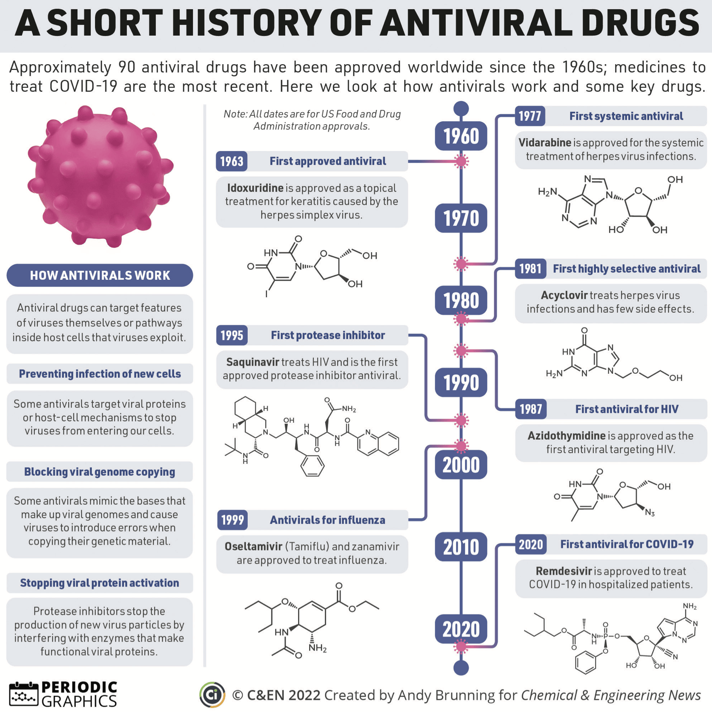

::: {.callout-caution title="Under construction"}
:::

J05 has a single level-3 group, the direct acting antivirals (J05A), which is split into level-4 groups by mechanism or by the virus treated (@tbl-antivirals) [@whoccATCDDDIndex2026].
By 2016, 90 antiviral drugs had been approved for nine human infectious diseases, among them HIV, hepatitis B and C, herpesvirus and influenza infections [@declercqApprovedAntiviralDrugs2016].
The disease side of HIV is covered in the [HIV primer](../../../../pathology-primers/viral/hiv/index.qmd).

{#fig-antivirals}

| J05 | ANTIVIRALS FOR SYSTEMIC USE |
| :--- | :--- |
| J05A | DIRECT ACTING ANTIVIRALS |
| J05AA | Thiosemicarbazones |
| J05AB | Nucleosides and nucleotides excl. reverse transcriptase inhibitors |
| J05AC | Cyclic amines |
| J05AD | Phosphonic acid derivatives |
| J05AE | Protease inhibitors |
| J05AF | Nucleoside and nucleotide reverse transcriptase inhibitors |
| J05AG | Non-nucleoside reverse transcriptase inhibitors |
| J05AH | Neuraminidase inhibitors |
| J05AJ | Integrase inhibitors |
| J05AP | Antivirals for treatment of HCV infections |
| J05AR | Antivirals for treatment of HIV infections, combinations |
| J05AX | Other antivirals |

: Codes for antivirals. {#tbl-antivirals tbl-colwidths="[10, 90]"}

## How do antivirals work?

HIV replicates inside cells of the immune system, and antiretroviral drugs act by blocking different steps of its life cycle [@bazzoliIntracellularPharmacokineticsAntiretroviral2010].

* **Reverse transcriptase inhibitors** block the ability of HIV to productively infect a cell [@perelsonMechanisticModelingSARSCoV22021].
  The nucleoside and nucleotide reverse transcriptase inhibitors (NRTIs, J05AF) are prodrugs, which the cell has to phosphorylate to their active triphosphate form.
  The non-nucleoside reverse transcriptase inhibitors (NNRTIs, J05AG) are not prodrugs, and inhibit the enzyme directly [@bazzoliIntracellularPharmacokineticsAntiretroviral2010].
* **Protease inhibitors** (J05AE) make infected cells produce immature, non-infectious virus particles [@perelsonMechanisticModelingSARSCoV22021].
* **Integrase inhibitors** (J05AJ), such as dolutegravir (J05AJ03), inhibit the strand transfer step of HIV integrase [@cottrellClinicalPharmacokineticPharmacodynamic2013].
* **Hepatitis C antivirals** (J05AP) include the fixed-dose combination of ledipasvir and sofosbuvir (J05AP51), which pairs an NS5A inhibitor with an NS5B polymerase inhibitor [@germanClinicalPharmacokineticsPharmacodynamics2016].
* **Neuraminidase inhibitors** (J05AH), such as oseltamivir (J05AH02), act against influenza by blocking the release of virus from infected cells [@declercqApprovedAntiviralDrugs2016].

## Intracellular exposure

The NRTIs act inside the infected cell, as triphosphates that the cell makes from the drug.
Most NRTI triphosphates have longer half-lives than their parent compounds.
The activity of the cell's kinases and uptake transporters may greatly influence the intracellular triphosphate concentrations.
For NRTIs, most studies could not establish a significant relationship between plasma and intracellular triphosphate concentrations.
In the well-designed prospective studies, virological efficacy correlated with intracellular NRTI concentrations, but not with plasma concentrations.
Measuring intracellular concentrations is still technically difficult, as is isolating and counting the peripheral blood mononuclear cells they are measured in [@bazzoliIntracellularPharmacokineticsAntiretroviral2010].

Sofosbuvir (J05AP08), a hepatitis C drug, is also activated inside the cell, and its active triphosphate is not detected in plasma.
Its predominant circulating metabolite, GS-331007, is the primary analyte in clinical pharmacology studies instead [@germanClinicalPharmacokineticsPharmacodynamics2016].

## Efficacy

For HIV and hepatitis C, the antiviral effect is followed as the viral load, and viral dynamic models describe its time course.
The basic model has three states: target cells, infected cells and free virus.
Target cells become infected when they meet virus, infected cells produce virus and die, and free virus is cleared.
A drug enters the model as a fractional efficacy between 0 and 1.
For a reverse transcriptase inhibitor it reduces new infections, and for a protease inhibitor it reduces the production of infectious virus.
Fitting such a model to the viral load decline under treatment gives estimates of the rate of virus clearance and the death rate of infected cells [@perelsonMechanisticModelingSARSCoV22021].

A model fitted to the decline in HIV viral load after a potent protease inhibitor gave a mean lifespan of 2.2 days for productively infected cells and 0.3 days for plasma virus particles (virions) [@perelsonHIV1DynamicsVivo1996].

In a hepatitis C viral kinetic model, Snoeck and colleagues used all hepatitis C virus (HCV) RNA measurements, including those below the lower limit of quantification (LLOQ).
They linked the viral kinetics to sustained virologic response (SVR) by adding a cure boundary to the model.
SVR, an undetectable viral load 24 weeks after the end of treatment, was then the primary clinical endpoint of hepatitis C treatment [@snoeckComprehensiveHepatitisViral2010].

For dolutegravir, antiviral activity correlates strongly with the trough concentration [@cottrellClinicalPharmacokineticPharmacodynamic2013].
For ledipasvir and sofosbuvir, pharmacokinetic/pharmacodynamic analyses found no exposure-response relationship for efficacy or safety [@germanClinicalPharmacokineticsPharmacodynamics2016].

## Safety

A review that sorted antimicrobials by how well exposure predicts toxicity placed none of the antivirals in the category with a defined threshold for therapeutic drug monitoring.
Ganciclovir (J05AB06), also given as its oral prodrug valganciclovir (J05AB14), is associated with low counts of all blood cell types (pancytopenia), kidney damage (nephrotoxicity) and nervous system toxicity (neurotoxicity).
Anemia has been associated with a ganciclovir AUC above 50 µg·h/mL, but no clearly defined exposure threshold for toxicity has been identified, and the relationship is hard to study because pancytopenia is already common in the patients who receive these drugs.
High-dose aciclovir (J05AB01) calls for close monitoring for neurotoxicity, nephrotoxicity and a low neutrophil count (neutropenia).
Cidofovir (J05AB12) and foscarnet (J05AD01) are both associated with nephrotoxicity that can be dose-limiting, with no defined relationship to exposure [@downesTooMuchGood2021].

Efavirenz (J05AG03) is metabolized mainly by CYP2B6, and patients with certain CYP2B6 variants may be at increased risk of adverse effects, particularly central nervous system toxicity [@destaClinicalPharmacogeneticsImplementation2019].

Dolutegravir inhibits the renal transporter OCT2, which reduces the tubular secretion of creatinine and raises serum creatinine.
These increases have not been associated with a decreased glomerular filtration rate [@cottrellClinicalPharmacokineticPharmacodynamic2013].

## References

::: {#refs}
:::
